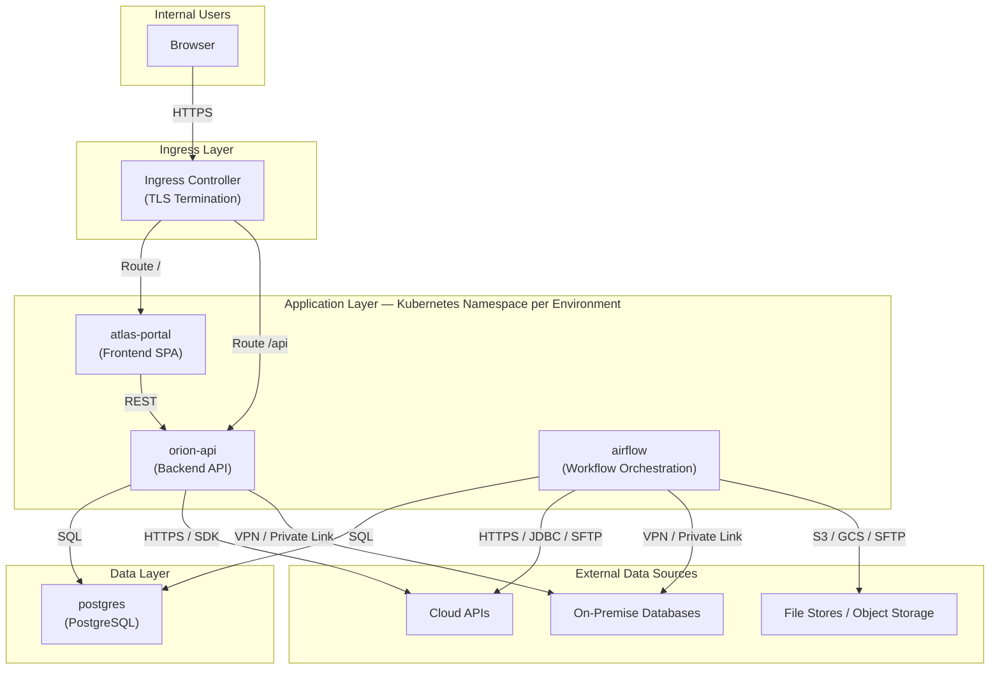
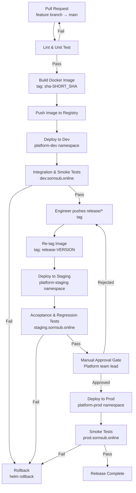

# Internal Web Application Platform — Architecture & CI/CD Design

> **Phase 1 — Architecture and CI/CD documentation only.**
> Application code, Docker Compose files, Kubernetes manifests, and GitHub Actions workflows will be implemented in a future phase.

---

## Table of Contents

1. [Project Overview](#1-project-overview)
2. [Architecture Overview](#2-architecture-overview)
3. [Architecture Diagram](#3-architecture-diagram)
4. [Environment Strategy](#4-environment-strategy)
5. [Deployment Strategy](#5-deployment-strategy)
6. [Configuration and Secret Management](#6-configuration-and-secret-management)
7. [External System and Database Connectivity](#7-external-system-and-database-connectivity)
8. [Monitoring, Logging, Health Checks, Alerting, and Incident Response](#8-monitoring-logging-health-checks-alerting-and-incident-response)
9. [CI/CD Pipeline Overview](#9-cicd-pipeline-overview)
10. [CI/CD Flow Diagram](#10-cicd-flow-diagram)
11. [Release Promotion Flow](#11-release-promotion-flow)
12. [Release Promotion Diagram](#12-release-promotion-diagram)
13. [Assumptions](#13-assumptions)
14. [How to Review This Repository](#14-how-to-review-this-repository)

---

## 1. Project Overview

This repository documents the architecture and CI/CD pipeline design for an **internal web application platform**. The platform aggregates data from multiple sources — cloud-hosted and on-premise — and presents results through a unified web interface for internal users.

### Services

| Service | Name | Role |
|---|---|---|
| Web Frontend | `atlas-portal` | Serves the browser-based UI to internal users |
| Backend API | `orion-api` | Handles business logic, data aggregation, and API responses |
| Workflow Orchestration | `airflow` | Schedules and executes data pipelines and ETL jobs |
| Database | `postgres` | Persistent relational storage for application and pipeline state |

### Environments

| Environment | Domain | Purpose |
|---|---|---|
| Development | `dev.sornsub.online` | Active development and integration testing |
| Staging | `staging.sornsub.online` | Pre-production validation and acceptance testing |
| Production | `prod.sornsub.online` | Live internal users |

---

## 2. Architecture Overview

The platform follows a **layered, service-oriented architecture** deployed on Kubernetes. Each environment runs in its own Kubernetes namespace. All inter-service communication happens through internal Kubernetes service discovery. External traffic enters exclusively through an ingress controller.

### Component Responsibilities

**`atlas-portal` — Frontend**

Serves a single-page application (SPA) to internal users over HTTPS. Communicates only with `orion-api` and never directly with the database or external data sources.

**`orion-api` — Backend API**

Exposes a REST API consumed by `atlas-portal`. Connects to PostgreSQL for persistent state, queries external data sources directly for real-time data, and consumes processed results written by Airflow pipelines.

**`airflow` — Workflow Orchestration**

Runs scheduled DAGs to extract, transform, and load data from external sources into PostgreSQL. Uses a dedicated schema within PostgreSQL for its own metadata.

**`postgres` — Database**

Provides relational storage for `orion-api` application data and Airflow metadata. Accessible only from within the cluster; never exposed publicly.

**Ingress Controller**

Single HTTPS entry point per environment. Routes traffic to `atlas-portal` and `orion-api` based on host and path rules. Terminates TLS using certificates managed by cert-manager.

**External Data Sources**

Cloud APIs, on-premise databases, or file stores accessed by `orion-api` for real-time queries and by `airflow` for batch pipelines. Connectivity approach is described in [Section 7](#7-external-system-and-database-connectivity).

---

## 3. Architecture Diagram



---

## 4. Environment Strategy

Each environment has a dedicated Kubernetes namespace and DNS subdomain, providing full isolation across the promotion path.

### Environment Matrix

| Attribute | `dev` | `staging` | `prod` |
|---|---|---|---|
| Domain | `dev.sornsub.online` | `staging.sornsub.online` | `prod.sornsub.online` |
| Kubernetes Namespace | `platform-dev` | `platform-staging` | `platform-prod` |
| Data | Synthetic / anonymised | Anonymised copy of production | Live internal data |
| Deployment Trigger | Merge to `main` (automatic) | Push of `release/*` tag (automatic) | Manual approval gate |
| Replica Count | 1 per service | 2 per service | ≥ 2 per service |
| Resource Limits | Relaxed | Matches production | Production-grade |
| Secret Store | Dev vault path | Staging vault path | Prod vault path |
| External Sources | Sandboxed / mock endpoints | Read-only staging endpoints | Live endpoints |

### Branch and Environment Mapping

```
feature/*  →  Pull Request validation (lint, unit tests)
                      |
                    main  ──────────────────→  dev      (auto-deploy on merge)
                      |
                release/*  ────────────────→  staging   (auto-deploy on tag)
                      |
              Manual approval  ────────────→  prod      (gated promotion)
```

---

## 5. Deployment Strategy

### Infrastructure Provisioning

Infrastructure — including the Kubernetes cluster, networking, DNS, and certificate management — is managed as code using Terraform. Environment-specific variable files (`dev.tfvars`, `staging.tfvars`, `prod.tfvars`) parametrise each environment. No infrastructure changes are applied manually; all changes go through a pull request and pipeline review.

### Application Deployment

Applications are deployed to Kubernetes using **Helm charts** stored under `charts/` in this repository. Each service has its own chart. A shared `values.yaml` defines defaults; environment overrides live in `values-dev.yaml`, `values-staging.yaml`, and `values-prod.yaml`.

### Deployment Lifecycle

| Step | `dev` | `staging` | `prod` |
|---|---|---|---|
| Trigger | Merge to `main` | Push of `release/*` tag | Manual approval |
| Image tag | `sha-<short-sha>` | `release-<version>` | Same tag as staging |
| Helm upgrade | Automatic | Automatic | Manual, with approval log |
| Rollback | Re-push or `helm rollback` | `helm rollback` | `helm rollback` with incident log |
| DB migrations | Automatic on deploy | Automatic on deploy | Separate migration Job, gated |

### Rollout Strategy

- **Dev:** `Recreate` — fast iteration; brief downtime is acceptable.
- **Staging and Prod:** `RollingUpdate` with `maxSurge: 1` and `maxUnavailable: 0` — zero-downtime rollouts.

### Database Migrations

Schema migrations are managed by a dedicated migration tool (e.g. Flyway or Liquibase). In staging and production, migrations run as a Kubernetes `Job` that must complete successfully before the new application version begins receiving traffic.

---

## 6. Configuration and Secret Management

### Principles

- No secrets in source code or container images.
- Secrets are injected at runtime from a dedicated secret store.
- Non-sensitive configuration is committed to the repository and version-controlled.

### Non-Sensitive Configuration

Feature flags, log levels, API base URLs, and timeout values are stored in Kubernetes `ConfigMap` resources, generated from Helm values files. These are safe to commit.

### Sensitive Configuration

Database passwords, API keys, OAuth client secrets, and private certificates are stored in **HashiCorp Vault** (or a cloud-native equivalent such as AWS Secrets Manager or GCP Secret Manager). The path structure mirrors the environment:

```
secret/platform/dev/orion-api/db-password
secret/platform/dev/airflow/fernet-key
secret/platform/staging/orion-api/db-password
secret/platform/prod/orion-api/db-password
```

At runtime, secrets are injected into pods via the **Vault Agent Sidecar Injector** or the **Secrets Store CSI Driver**, appearing as environment variables or mounted files. They are never passed through CI/CD pipeline logs.

### Access Control

- Each service's Kubernetes `ServiceAccount` is granted only the Vault policy paths it requires (least privilege).
- Human access to production secrets requires MFA and is audited.
- Secret rotation uses Vault's dynamic secrets where available (e.g. short-lived database credentials).

---

## 7. External System and Database Connectivity

### PostgreSQL (Internal)

PostgreSQL runs inside the Kubernetes cluster or as a managed service (e.g. Cloud SQL or RDS) in production. It is never exposed outside the cluster. Connection strings are provided via secrets described in Section 6.

### External Cloud APIs

- Connected over HTTPS from within the cluster.
- API keys are stored in Vault and injected as environment variables.
- Outbound traffic is routed through a NAT gateway with a fixed egress IP, enabling external providers to allowlist the platform's outbound address.

### On-Premise Data Sources

- Connected via a site-to-site VPN or dedicated private link between the cluster network and the on-premise network.
- No on-premise credentials are stored in the cluster in plaintext; all credentials are fetched from Vault at runtime.
- A proxy service may be used where a direct VPN is not available, exposing only the required ports.

### Airflow Data Flow

```
External Source  →  Airflow DAG (extract + transform)  →  PostgreSQL (load)
                                                                  |
                                                              orion-api reads
                                                                  |
                                                          atlas-portal displays
```

Airflow DAG connections to external APIs use credentials stored in Airflow's encrypted `Connection` store, backed by the same Vault paths used by the rest of the platform.

### Network Security

- Internal service-to-service traffic stays within the cluster namespace.
- Kubernetes `NetworkPolicy` rules restrict which pods can reach PostgreSQL and the Airflow web UI.
- All external egress passes through a controlled NAT point for auditability.

---

## 8. Monitoring, Logging, Health Checks, Alerting, and Incident Response

### Health Checks

Every service exposes standard Kubernetes health endpoints:

| Endpoint | Purpose | Used By |
|---|---|---|
| `/health/live` | Liveness — is the process alive? | Kubernetes `livenessProbe` |
| `/health/ready` | Readiness — can the pod serve traffic? | Kubernetes `readinessProbe` |
| `/metrics` | Prometheus metrics scrape endpoint | Prometheus |

Airflow exposes its own health endpoint on its web server, monitored the same way.

### Metrics and Dashboards

- **Prometheus** scrapes `/metrics` from all services at a regular interval.
- **Grafana** provides dashboards covering:
  - Request rate, error rate, and latency (RED method) for `atlas-portal` and `orion-api`.
  - DAG success/failure rates and task duration for Airflow.
  - PostgreSQL connection pool usage, query latency, and disk usage.
  - Kubernetes node and pod resource usage (CPU, memory, restart counts).

### Logging

- All services write structured **JSON logs to stdout/stderr** — no log files inside containers.
- A **Fluent Bit** DaemonSet collects container logs from each node and forwards them to a central log store (e.g. Loki, Elasticsearch/OpenSearch, or a cloud-native logging service).
- Every log entry includes the fields `environment`, `service`, `version`, and `trace_id` to support correlation across services.
- Retention: 14 days for dev, 30 days for staging, 90 days for prod.

### Alerting

Alerts are defined as Prometheus alerting rules and routed through **Alertmanager**:

| Alert | Condition | Severity | Channel |
|---|---|---|---|
| High error rate | HTTP 5xx > 5% for 2 minutes | Critical | PagerDuty / `#alerts-prod` |
| Pod crash-looping | Restart count rising continuously | Warning | `#alerts-prod` |
| DAG failure | Airflow DAG missed or failed | Warning | `#alerts-airflow` |
| High latency | p99 response > 2 s for 5 minutes | Warning | `#alerts-prod` |
| Resource pressure | Node CPU or memory > 85% | Warning | `#alerts-infra` |
| Certificate expiry | TLS cert expires in < 14 days | Warning | `#alerts-infra` |

Alerts in dev and staging route to lower-priority channels to reduce noise.

### Incident Response

1. **Detect** — Alertmanager fires; the on-call engineer is paged (prod) or notified via Slack (non-prod).
2. **Triage** — Review Grafana dashboards and recent deployment history.
3. **Contain** — Roll back the last release with `helm rollback` if a bad deploy is suspected; scale replicas if under load.
4. **Resolve** — Fix is pushed through the normal PR → CI → deploy flow, or via an expedited hotfix branch with fast-track review.
5. **Post-mortem** — Written within 48 hours for any production incident that affected users. Focuses on timeline, root cause, and action items.

---

## 9. CI/CD Pipeline Overview

The CI/CD pipeline will be implemented using **GitHub Actions**, with workflow definitions stored under `.github/workflows/`. Implementation is planned for a future phase; this section describes the intended design.

### Pipeline Stages

| Stage | Trigger | What Happens |
|---|---|---|
| **Lint & Test** | Every pull request | Code linting, unit tests, static analysis, Dockerfile linting |
| **Build** | Merge to `main` | Docker image built, tagged `sha-<short-sha>`, pushed to registry |
| **Deploy to Dev** | Merge to `main` | Helm upgrade applied to `platform-dev` namespace |
| **Integration Test** | After dev deploy | Smoke tests and API contract tests against `dev.sornsub.online` |
| **Tag Release** | Engineer pushes `release/<version>` tag | Image re-tagged as `release-<version>` |
| **Deploy to Staging** | `release/*` tag pushed | Helm upgrade applied to `platform-staging` namespace |
| **Acceptance Test** | After staging deploy | Full regression suite against `staging.sornsub.online` |
| **Promote to Prod** | Manual approval | Same image promoted; Helm upgrade applied to `platform-prod` namespace |
| **Post-Deploy Verify** | After prod deploy | Smoke tests against `prod.sornsub.online`; automatic rollback if failing |

### Image Tagging Convention

| Context | Tag Format | Example |
|---|---|---|
| Dev build | `sha-<short-sha>` | `sha-a1b2c3d` |
| Release candidate | `release-<version>` | `release-1.4.0` |
| Production (promoted) | Same tag as staging | `release-1.4.0` |

No new image is built when promoting to production. The exact image tested in staging is what gets deployed.

---

## 10. CI/CD Flow Diagram



---

## 11. Release Promotion Flow

A **promotion model** is used throughout: no new image is built when moving from staging to production. The image that passed all staging tests is promoted as-is to production. This guarantees that the artefact tested is identical to the artefact deployed.

### Promotion Steps

1. Developer merges feature work to `main` → pipeline automatically deploys to `dev`.
2. Integration and smoke tests run against `dev.sornsub.online`.
3. Release manager (or developer) pushes a `release/<version>` tag → pipeline re-tags the image and deploys to `staging`.
4. Acceptance and regression tests run against `staging.sornsub.online`.
5. Platform team lead reviews results and approves the promotion.
6. The same image is deployed to `prod.sornsub.online`.
7. Automated smoke tests confirm the production deployment. Automatic rollback fires if tests fail.

### Image Identity Across Environments

```
Build once  →  sha-a1b2c3d   (dev)
Re-tag      →  release-1.4.0 (staging)
Promote     →  release-1.4.0 (prod — same image, no rebuild)
```

---

## 12. Release Promotion Diagram

```mermaid
flowchart LR
    subgraph DEV["dev.sornsub.online"]
        D1["Deploy\nsha-a1b2c3
